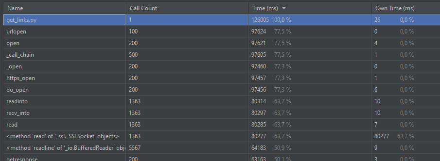
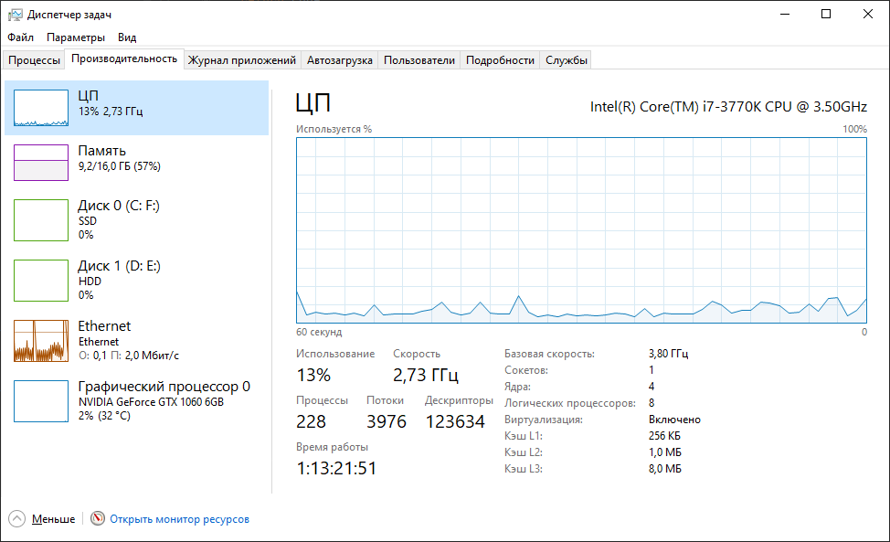
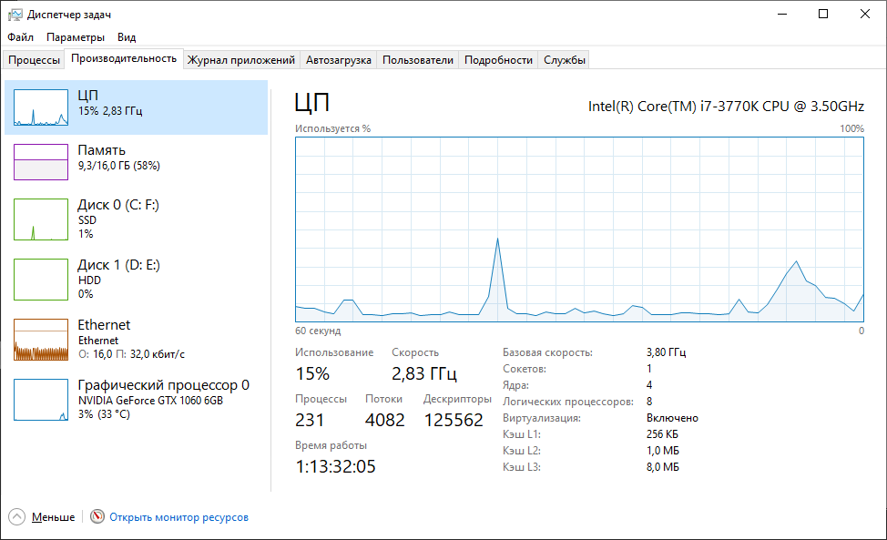
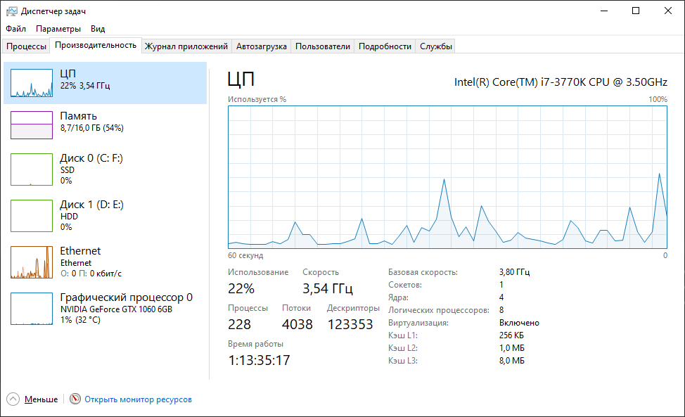

# Первое задание
## Проверка ссылок
### Асинхронно - 126 сек

### 5 потоков - 422 сек

### 10 потоков - 234 сек

### 100 потоков - 111 сек

Используя ThreadPoolExecutor, можно значительно увеличть скорость проверки ссылок.
Изменение количества воркеров существенно не влияет на загрузку памяти, процессора. Однако увеличение количества воркеров приводит к уменьшению времени работы программы и увелечению активности отправки и получения в сети.

# Второе задание
1 поток - 318 сек
2 потока - 102 сек
4 потока - 75 сек
5 потоков - 75 сек
10 потоков - 74 сек
100 потоков - 76 сек

Изменение количества воркеров влияет на загрузку памяти и процессора. Увеличение скорости генерации монет будет происходить, пока количество воркеров не превышает число ядер процессора. При 5 и более воркерах не происходит увеличение скорости генерации, так как у процессора всего 4 ядра.
